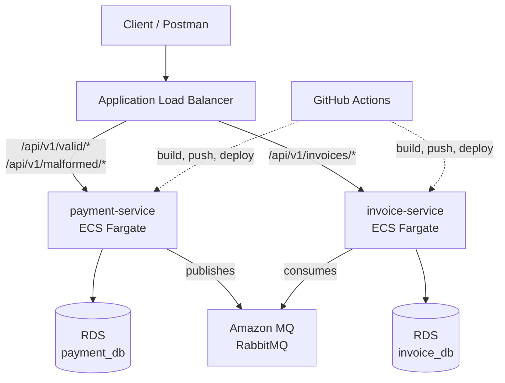

# AWS Deployment Guide

This guide deploys the **RabbitMQ Retry and DLQ** sample to AWS using ECS Fargate, RDS, and Amazon MQ. The local Docker Compose setup is in [README.md](./README.md).

**What this demonstrates:** containerizing Spring Boot microservices, pushing to a private registry (ECR), running them serverless on ECS Fargate behind an Application Load Balancer, with managed PostgreSQL (RDS), managed RabbitMQ (Amazon MQ), credentials in Secrets Manager, logs in CloudWatch, and a GitHub Actions CI/CD pipeline.

---

## Architecture



| AWS service | Role |
|---|---|
| ECR | Stores the two Docker images |
| ECS Fargate | Runs the containers (serverless) |
| RDS PostgreSQL | `payment_db` and `invoice_db` |
| Amazon MQ | Shared RabbitMQ broker |
| ALB | Routes HTTP traffic to each service by path |
| Secrets Manager | DB and broker passwords |
| CloudWatch | Application logs |
| GitHub Actions | CI/CD pipeline |

---

## Before You Start

- An AWS account, and the [AWS CLI](https://aws.amazon.com/cli/) installed.
- A **bash shell**. On Windows use **Git Bash** (bundled with [Git for Windows](https://git-scm.com/download/win)) — the commands below will not run in CMD or PowerShell.
- Docker installed locally.

Configure the CLI (fill the four prompts interactively):

```bash
aws configure
#   AWS Access Key ID:      <your key>
#   AWS Secret Access Key:  <your secret>
#   Default region name:    eu-west-1
#   Default output format:  json
```

Set the three values reused throughout. Keep this terminal open while you work; if you return later in a new window, see [Resuming Later](#resuming-later).

```bash
export AWS_REGION=eu-west-1
export ACCOUNT_ID=$(aws sts get-caller-identity --query Account --output text)
export ECR_REGISTRY=$ACCOUNT_ID.dkr.ecr.$AWS_REGION.amazonaws.com
```

> **Cost note:** This uses public subnets so containers can reach AWS services without a NAT gateway (~$32/month saved). Nothing is internet-exposed except the load balancer. Remember to run [Teardown](#teardown) when finished — RDS and Amazon MQ bill hourly.

---

## Phase 1 — Network & Security Groups

Find the default VPC and two subnets, then create one security group per tier.

```bash
export VPC_ID=$(aws ec2 describe-vpcs --filters "Name=isDefault,Values=true" \
  --query 'Vpcs[0].VpcId' --output text)
export SUBNETS=$(aws ec2 describe-subnets --filters "Name=vpc-id,Values=$VPC_ID" \
  --query 'Subnets[0:2].SubnetId' --output text)
export SUBNET_1=$(echo $SUBNETS | cut -d' ' -f1)
export SUBNET_2=$(echo $SUBNETS | cut -d' ' -f2)
```

Create the four security groups. The helper returns an existing group's ID instead of failing, so this is safe to re-run.

```bash
sg () {
  local id=$(aws ec2 describe-security-groups \
    --filters "Name=group-name,Values=$1" "Name=vpc-id,Values=$VPC_ID" \
    --query 'SecurityGroups[0].GroupId' --output text 2>/dev/null)
  [ "$id" = "None" ] || [ -z "$id" ] && \
    id=$(aws ec2 create-security-group --group-name "$1" --description "$1" \
      --vpc-id $VPC_ID --query 'GroupId' --output text)
  echo "$id"
}

export ALB_SG=$(sg retry-dlq-alb-sg)
export ECS_SG=$(sg retry-dlq-ecs-sg)
export RDS_SG=$(sg retry-dlq-rds-sg)
export MQ_SG=$(sg  retry-dlq-mq-sg)
```

Add the rules (duplicate-rule errors on re-run are harmless):

```bash
# ALB: HTTP from anywhere
aws ec2 authorize-security-group-ingress --group-id $ALB_SG --protocol tcp --port 80 --cidr 0.0.0.0/0
# ECS: app ports from the ALB only
aws ec2 authorize-security-group-ingress --group-id $ECS_SG --protocol tcp --port 8081 --source-group $ALB_SG
aws ec2 authorize-security-group-ingress --group-id $ECS_SG --protocol tcp --port 8082 --source-group $ALB_SG
# RDS: Postgres from ECS only
aws ec2 authorize-security-group-ingress --group-id $RDS_SG --protocol tcp --port 5432 --source-group $ECS_SG
# MQ: AMQPS from ECS only
aws ec2 authorize-security-group-ingress --group-id $MQ_SG  --protocol tcp --port 5671 --source-group $ECS_SG
```

**Verify:** all four should print a `sg-...` value.

```bash
echo "$ALB_SG $ECS_SG $RDS_SG $MQ_SG"
```

---

## Phase 2 — ECR & Images

Create a repository per service and push the first image (ECS needs `:latest` to exist before it can start).

```bash
aws ecr create-repository --repository-name retry-dlq/payment-service
aws ecr create-repository --repository-name retry-dlq/invoice-service

aws ecr get-login-password | docker login --username AWS --password-stdin $ECR_REGISTRY

docker build -t $ECR_REGISTRY/retry-dlq/payment-service:latest ./payment-service
docker push  $ECR_REGISTRY/retry-dlq/payment-service:latest

docker build -t $ECR_REGISTRY/retry-dlq/invoice-service:latest ./invoice-service
docker push  $ECR_REGISTRY/retry-dlq/invoice-service:latest
```

**Verify:** both images are listed.

```bash
aws ecr list-images --repository-name retry-dlq/payment-service --query 'imageIds[].imageTag' --output text
aws ecr list-images --repository-name retry-dlq/invoice-service --query 'imageIds[].imageTag' --output text
```

---

## Phase 3 — RDS (PostgreSQL)

`--engine-version` needs a real minor version. List what's available and pick one:

```bash
aws rds describe-db-engine-versions --engine postgres \
  --query 'DBEngineVersions[].EngineVersion' --output text
export PG=16.4   # replace with a value from the list
```

Create both databases (replace the password):

```bash
for db in payment invoice; do
  aws rds create-db-instance \
    --db-instance-identifier ${db}-db \
    --db-instance-class db.t3.micro \
    --engine postgres --engine-version $PG \
    --master-username postgres --master-user-password "<your-db-password>" \
    --db-name ${db}_db --allocated-storage 20 \
    --vpc-security-group-ids $RDS_SG --no-publicly-accessible
done
```

Databases take ~5 minutes. **Verify** both report `available`:

```bash
aws rds describe-db-instances --query 'DBInstances[].[DBInstanceIdentifier,DBInstanceStatus]' --output text
```

---

## Phase 4 — Amazon MQ (RabbitMQ)

Pick a supported engine version:

```bash
aws mq describe-broker-engine-types --engine-type RABBITMQ \
  --query 'BrokerEngineTypes[0].EngineVersions[].Name' --output text
export MQ_VERSION=3.13.2   # replace with a value from the list
```

Create the broker (replace the password):

```bash
aws mq create-broker \
  --broker-name retry-dlq-broker \
  --engine-type RABBITMQ --engine-version $MQ_VERSION \
  --deployment-mode SINGLE_INSTANCE --host-instance-type mq.t3.micro \
  --no-publicly-accessible --security-groups $MQ_SG --subnet-ids $SUBNET_1 \
  --users "Username=mquser,Password=<your-mq-password>,ConsoleAccess=true"
```

The broker takes a few minutes. **Verify** it reports `RUNNING`:

```bash
aws mq list-brokers --query 'BrokerSummaries[].[BrokerName,BrokerState]' --output text
```

---

## Phase 5 — Secrets Manager

Store the three credentials. ECS reads these at container start.

```bash
aws secretsmanager create-secret --name retry-dlq/payment-db \
  --secret-string '{"password":"<your-db-password>"}'
aws secretsmanager create-secret --name retry-dlq/invoice-db \
  --secret-string '{"password":"<your-db-password>"}'
aws secretsmanager create-secret --name retry-dlq/mq \
  --secret-string '{"username":"mquser","password":"<your-mq-password>"}'
```

Create an IAM policy granting read access to just these secrets:

```bash
cat > secrets-policy.json << EOF
{
  "Version": "2012-10-17",
  "Statement": [{
    "Effect": "Allow",
    "Action": ["secretsmanager:GetSecretValue"],
    "Resource": "arn:aws:secretsmanager:${AWS_REGION}:${ACCOUNT_ID}:secret:retry-dlq/*"
  }]
}
EOF

export SECRETS_POLICY=$(aws iam create-policy --policy-name retry-dlq-secrets \
  --policy-document file://secrets-policy.json --query 'Policy.Arn' --output text)
```

---

## Phase 6 — ECS Fargate

### 6.1 Cluster, log groups, and execution role

```bash
aws ecs create-cluster --cluster-name retry-dlq

aws logs create-log-group --log-group-name /ecs/retry-dlq/payment-service
aws logs create-log-group --log-group-name /ecs/retry-dlq/invoice-service

aws iam create-role --role-name retry-dlq-exec \
  --assume-role-policy-document '{"Version":"2012-10-17","Statement":[{"Effect":"Allow","Principal":{"Service":"ecs-tasks.amazonaws.com"},"Action":"sts:AssumeRole"}]}'

aws iam attach-role-policy --role-name retry-dlq-exec \
  --policy-arn arn:aws:iam::aws:policy/service-role/AmazonECSTaskExecutionRolePolicy
aws iam attach-role-policy --role-name retry-dlq-exec --policy-arn $SECRETS_POLICY
```

### 6.2 Capture the RDS and MQ endpoints

```bash
export PAYMENT_DB=$(aws rds describe-db-instances --db-instance-identifier payment-db \
  --query 'DBInstances[0].Endpoint.Address' --output text)
export INVOICE_DB=$(aws rds describe-db-instances --db-instance-identifier invoice-db \
  --query 'DBInstances[0].Endpoint.Address' --output text)
export BROKER_ID=$(aws mq list-brokers \
  --query "BrokerSummaries[?BrokerName=='retry-dlq-broker'].BrokerId" --output text)
export MQ_HOST=$(aws mq describe-broker --broker-id $BROKER_ID \
  --query 'BrokerInstances[0].Endpoints[0]' --output text | sed -E 's#amqps://##; s#:5671##')
```

### 6.3 Register the task definitions

```bash
for svc in payment invoice; do
  if [ "$svc" = "payment" ]; then PORT=8081; DB=$PAYMENT_DB; DBNAME=payment_db; EXTRA=""; else
    PORT=8082; DB=$INVOICE_DB; DBNAME=invoice_db
    EXTRA='{"name":"SPRING_RABBITMQ_LISTENER_SIMPLE_DEFAULT_REQUEUE_REJECTED","value":"false"},
           {"name":"APP_RETRY_INVOICE_MAX_ATTEMPTS","value":"3"},
           {"name":"APP_RETRY_INVOICE_DELAY","value":"1000"},
           {"name":"APP_RETRY_INVOICE_MULTIPLIER","value":"1.0"},
           {"name":"APP_RETRY_INVOICE_MAX_DELAY","value":"1000"},'
  fi

  cat > ${svc}-task.json << EOF
{
  "family": "${svc}-service",
  "networkMode": "awsvpc",
  "requiresCompatibilities": ["FARGATE"],
  "cpu": "256", "memory": "512",
  "executionRoleArn": "arn:aws:iam::${ACCOUNT_ID}:role/retry-dlq-exec",
  "containerDefinitions": [{
    "name": "${svc}-service",
    "image": "${ECR_REGISTRY}/retry-dlq/${svc}-service:latest",
    "portMappings": [{"containerPort": ${PORT}}],
    "environment": [
      {"name":"SPRING_DATASOURCE_URL","value":"jdbc:postgresql://${DB}:5432/${DBNAME}"},
      {"name":"SPRING_DATASOURCE_USERNAME","value":"postgres"},
      {"name":"SPRING_RABBITMQ_HOST","value":"${MQ_HOST}"},
      {"name":"SPRING_RABBITMQ_PORT","value":"5671"},
      {"name":"SPRING_RABBITMQ_SSL_ENABLED","value":"true"},
      ${EXTRA}
      {"name":"_PLACEHOLDER","value":"ignore"}
    ],
    "secrets": [
      {"name":"SPRING_DATASOURCE_PASSWORD","valueFrom":"arn:aws:secretsmanager:${AWS_REGION}:${ACCOUNT_ID}:secret:retry-dlq/${svc}-db:password::"},
      {"name":"SPRING_RABBITMQ_USERNAME","valueFrom":"arn:aws:secretsmanager:${AWS_REGION}:${ACCOUNT_ID}:secret:retry-dlq/mq:username::"},
      {"name":"SPRING_RABBITMQ_PASSWORD","valueFrom":"arn:aws:secretsmanager:${AWS_REGION}:${ACCOUNT_ID}:secret:retry-dlq/mq:password::"}
    ],
    "logConfiguration": {
      "logDriver": "awslogs",
      "options": {
        "awslogs-group": "/ecs/retry-dlq/${svc}-service",
        "awslogs-region": "${AWS_REGION}",
        "awslogs-stream-prefix": "ecs"
      }
    }
  }]
}
EOF
  aws ecs register-task-definition --cli-input-json file://${svc}-task.json
done
```

> The `_PLACEHOLDER` entry just lets the optional `EXTRA` block end with a comma cleanly. Harmless — Spring ignores unknown env vars.

---

## Phase 7 — Load Balancer & Services

### 7.1 ALB and target groups

```bash
export ALB_ARN=$(aws elbv2 create-load-balancer --name retry-dlq-alb \
  --subnets $SUBNET_1 $SUBNET_2 --security-groups $ALB_SG \
  --scheme internet-facing --type application \
  --query 'LoadBalancers[0].LoadBalancerArn' --output text)

export PAY_TG=$(aws elbv2 create-target-group --name payment-tg \
  --protocol HTTP --port 8081 --vpc-id $VPC_ID --target-type ip \
  --health-check-path /actuator/health \
  --query 'TargetGroups[0].TargetGroupArn' --output text)

export INV_TG=$(aws elbv2 create-target-group --name invoice-tg \
  --protocol HTTP --port 8082 --vpc-id $VPC_ID --target-type ip \
  --health-check-path /actuator/health \
  --query 'TargetGroups[0].TargetGroupArn' --output text)
```

> ⚠️ **Health checks need Spring Boot Actuator.** Target groups check `/actuator/health`. If `spring-boot-starter-actuator` is missing from a service's `pom.xml`, health checks return 404, targets never go healthy, and **ECS restarts the tasks forever**. Either add the dependency, or change `--health-check-path` to a real 200 endpoint (`/api/v1/valid/payments` and `/api/v1/invoices`). This is the most common cause of a stuck deployment.

### 7.2 Listener and routing rules

```bash
export LISTENER=$(aws elbv2 create-listener --load-balancer-arn $ALB_ARN \
  --protocol HTTP --port 80 \
  --default-actions Type=fixed-response,FixedResponseConfig='{StatusCode=404,ContentType=text/plain,MessageBody=Not Found}' \
  --query 'Listeners[0].ListenerArn' --output text)

aws elbv2 create-rule --listener-arn $LISTENER --priority 10 \
  --conditions Field=path-pattern,Values='/api/v1/valid/payments*' \
  --actions Type=forward,TargetGroupArn=$PAY_TG
aws elbv2 create-rule --listener-arn $LISTENER --priority 20 \
  --conditions Field=path-pattern,Values='/api/v1/malformed/*' \
  --actions Type=forward,TargetGroupArn=$PAY_TG
aws elbv2 create-rule --listener-arn $LISTENER --priority 30 \
  --conditions Field=path-pattern,Values='/api/v1/invoices*' \
  --actions Type=forward,TargetGroupArn=$INV_TG
```

### 7.3 Create the services

```bash
aws ecs create-service --cluster retry-dlq --service-name payment-service \
  --task-definition payment-service --desired-count 1 --launch-type FARGATE \
  --network-configuration "awsvpcConfiguration={subnets=[$SUBNET_1,$SUBNET_2],securityGroups=[$ECS_SG],assignPublicIp=ENABLED}" \
  --load-balancers "targetGroupArn=$PAY_TG,containerName=payment-service,containerPort=8081"

aws ecs create-service --cluster retry-dlq --service-name invoice-service \
  --task-definition invoice-service --desired-count 1 --launch-type FARGATE \
  --network-configuration "awsvpcConfiguration={subnets=[$SUBNET_1,$SUBNET_2],securityGroups=[$ECS_SG],assignPublicIp=ENABLED}" \
  --load-balancers "targetGroupArn=$INV_TG,containerName=invoice-service,containerPort=8082"
```

**Verify:** get the public URL, then test it once the tasks are healthy (1-2 minutes).

```bash
aws elbv2 describe-load-balancers --names retry-dlq-alb --query 'LoadBalancers[0].DNSName' --output text
# curl http://<that-dns>/api/v1/valid/payments
```

| Endpoint | Path |
|---|---|
| Create payment | `POST /api/v1/valid/payments` |
| Publish malformed | `POST /api/v1/malformed/payments/payment-completed` |
| List invoices | `GET /api/v1/invoices` |

---

## Phase 8 — CI/CD (GitHub Actions)

Add `.github/workflows/deploy.yml`:

```yaml
name: Deploy to ECS
on:
  push:
    branches: [main]
env:
  AWS_REGION: eu-west-1
jobs:
  deploy:
    runs-on: ubuntu-latest
    steps:
      - uses: actions/checkout@v4
      - uses: aws-actions/configure-aws-credentials@v4
        with:
          aws-access-key-id: ${{ secrets.AWS_ACCESS_KEY_ID }}
          aws-secret-access-key: ${{ secrets.AWS_SECRET_ACCESS_KEY }}
          aws-region: ${{ env.AWS_REGION }}
      - uses: aws-actions/amazon-ecr-login@v2
        id: ecr
      - name: Build, push, deploy
        env:
          REG: ${{ steps.ecr.outputs.registry }}
        run: |
          for svc in payment invoice; do
            docker build -t $REG/retry-dlq/$svc-service:${{ github.sha }} ./$svc-service
            docker push  $REG/retry-dlq/$svc-service:${{ github.sha }}
            docker tag   $REG/retry-dlq/$svc-service:${{ github.sha }} $REG/retry-dlq/$svc-service:latest
            docker push  $REG/retry-dlq/$svc-service:latest
            aws ecs update-service --cluster retry-dlq --service $svc-service --force-new-deployment
          done
```

Add these repository secrets under **Settings → Secrets and variables → Actions**: `AWS_ACCESS_KEY_ID`, `AWS_SECRET_ACCESS_KEY`.

---

## Logs

```bash
aws logs tail /ecs/retry-dlq/payment-service --follow
aws logs tail /ecs/retry-dlq/invoice-service --follow
```

## Troubleshooting

| Symptom | Cause |
|---|---|
| Tasks start then stop in a loop | Health check failing — Actuator missing or wrong path (7.1) |
| Task stuck `PENDING` | Can't reach ECR/Secrets — confirm `assignPublicIp=ENABLED` |
| `unable to pull secrets` | Execution role missing secrets policy, or secret name mismatch |
| RabbitMQ connection refused | `SPRING_RABBITMQ_SSL_ENABLED` not `true`, or MQ SG rule missing |
| DB connection timeout | RDS SG not allowing 5432 from the ECS SG |
| ALB returns 503 | No healthy targets yet — check target group health |

---

## Resuming Later

Shell variables are lost when you close the terminal. In a new Git Bash window, re-run the [Before You Start](#before-you-start) exports plus this lookup block to restore everything from resources that already exist:

```bash
export VPC_ID=$(aws ec2 describe-vpcs --filters "Name=isDefault,Values=true" --query 'Vpcs[0].VpcId' --output text)
export SUBNETS=$(aws ec2 describe-subnets --filters "Name=vpc-id,Values=$VPC_ID" --query 'Subnets[0:2].SubnetId' --output text)
export SUBNET_1=$(echo $SUBNETS | cut -d' ' -f1); export SUBNET_2=$(echo $SUBNETS | cut -d' ' -f2)
g () { aws ec2 describe-security-groups --filters "Name=group-name,Values=$1" "Name=vpc-id,Values=$VPC_ID" --query 'SecurityGroups[0].GroupId' --output text; }
export ALB_SG=$(g retry-dlq-alb-sg); export ECS_SG=$(g retry-dlq-ecs-sg)
export RDS_SG=$(g retry-dlq-rds-sg); export MQ_SG=$(g retry-dlq-mq-sg)
```

---

## Teardown

Remove everything to stop charges (RDS and Amazon MQ are the costly ones).

```bash
aws ecs update-service --cluster retry-dlq --service payment-service --desired-count 0
aws ecs update-service --cluster retry-dlq --service invoice-service --desired-count 0
aws ecs delete-service --cluster retry-dlq --service payment-service --force
aws ecs delete-service --cluster retry-dlq --service invoice-service --force
aws ecs delete-cluster --cluster retry-dlq

aws elbv2 delete-load-balancer --load-balancer-arn $ALB_ARN; sleep 30
aws elbv2 delete-target-group --target-group-arn $PAY_TG
aws elbv2 delete-target-group --target-group-arn $INV_TG

aws mq delete-broker --broker-id $BROKER_ID
aws rds delete-db-instance --db-instance-identifier payment-db --skip-final-snapshot
aws rds delete-db-instance --db-instance-identifier invoice-db --skip-final-snapshot

aws ecr delete-repository --repository-name retry-dlq/payment-service --force
aws ecr delete-repository --repository-name retry-dlq/invoice-service --force

aws secretsmanager delete-secret --secret-id retry-dlq/payment-db --force-delete-without-recovery
aws secretsmanager delete-secret --secret-id retry-dlq/invoice-db --force-delete-without-recovery
aws secretsmanager delete-secret --secret-id retry-dlq/mq --force-delete-without-recovery

aws logs delete-log-group --log-group-name /ecs/retry-dlq/payment-service
aws logs delete-log-group --log-group-name /ecs/retry-dlq/invoice-service

# Security groups only delete after RDS/MQ are fully gone (wait a few minutes)
aws ec2 delete-security-group --group-id $ECS_SG
aws ec2 delete-security-group --group-id $RDS_SG
aws ec2 delete-security-group --group-id $MQ_SG
aws ec2 delete-security-group --group-id $ALB_SG

aws iam detach-role-policy --role-name retry-dlq-exec --policy-arn arn:aws:iam::aws:policy/service-role/AmazonECSTaskExecutionRolePolicy
aws iam detach-role-policy --role-name retry-dlq-exec --policy-arn $SECRETS_POLICY
aws iam delete-role --role-name retry-dlq-exec
aws iam delete-policy --policy-arn $SECRETS_POLICY
```

---

## Production Notes (Out of Scope Here)

For a real deployment you would: place tasks and RDS in **private subnets** with a NAT gateway or VPC endpoints; run RDS and Amazon MQ **Multi-AZ**; terminate **TLS at the ALB** (HTTPS) with an ACM certificate; and manage all of this with **Terraform** or **CloudFormation** instead of CLI commands.