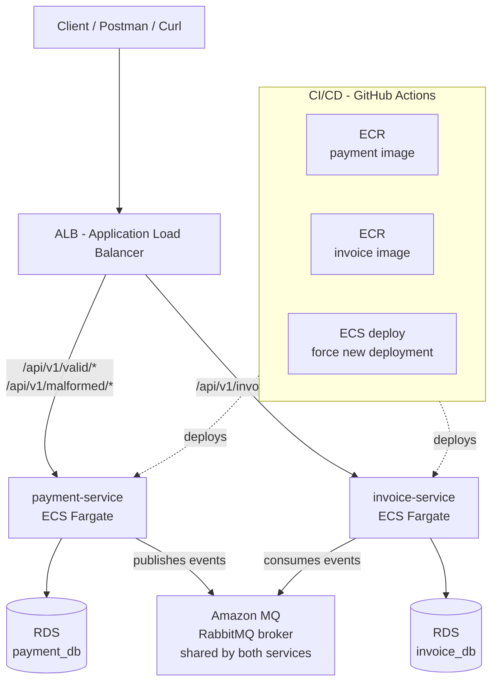

# AWS Deployment Guide — RabbitMQ Retry and DLQ Sample

This document covers deploying the `rabbitmq-rety-dlq-sample` project to AWS.

The local setup (Docker Compose) is documented in [README.md](./README.md).

---

## AWS Architecture



## AWS Services Used

| Service | Purpose |
|---|---|
| **ECR** | Container registry for Docker images |
| **ECS Fargate** | Serverless container runtime |
| **RDS PostgreSQL** | Managed databases for payment_db and invoice_db |
| **Amazon MQ** | Managed RabbitMQ broker |
| **ALB** | Application Load Balancer — routes traffic to each service |
| **Secrets Manager** | Stores RDS and Amazon MQ credentials securely |
| **IAM** | Task execution roles with least-privilege permissions |
| **VPC** | Network isolation — security groups scoped per tier |
| **CloudWatch** | Centralized logs for both services |
| **GitHub Actions** | CI/CD pipeline — build, push to ECR, deploy to ECS |

---

## Prerequisites

- AWS account with sufficient permissions (or AdministratorAccess for initial setup)
- **A bash shell.** This guide uses bash syntax throughout (`export`, `$VAR`, `\` line continuations). On Windows, use **Git Bash** (bundled with [Git for Windows](https://git-scm.com/download/win)) or WSL — the commands will not work as-is in CMD or PowerShell.
- AWS CLI installed. Verify it's reachable from your shell:

```bash
aws --version
```

- Configure the CLI by running:

```bash
aws configure
```

This prompts you interactively for four values — type each one and press Enter:

```
AWS Access Key ID [None]: <your access key>
AWS Secret Access Key [None]: <your secret key>
Default region name [None]: eu-west-1
Default output format [None]: json
```

- Docker installed locally
- GitHub repository with the project pushed

### A Note on This Guide's Approach

Every phase below **captures resource IDs into shell variables** (e.g. `VPC_ID`, `ECS_SG_ID`) and references them by ID, not by name. This matters because:

- In a real (non-default) VPC, security group rules **must** reference other groups by ID, not by name.
- It makes the commands copy-paste safe in a single terminal session.

Run all commands in the **same terminal session** so the variables persist. If you open a new terminal, re-export the IDs (each phase shows how to retrieve them).

> **Network design choice:** For simplicity and to keep this a low-cost portfolio deployment, ECS tasks and RDS run in the VPC's **public subnets** with tasks assigned public IPs. This avoids needing a NAT gateway (which costs ~$32/month) for tasks to reach ECR and Secrets Manager. Security is still enforced by security groups — nothing is open to the internet except the ALB on port 80. The production-grade alternative (private subnets + NAT gateway or VPC endpoints) is noted at the end.

---

## Phase 0 — Networking & Security Groups
 
This phase creates all four security groups first, then adds their rules. Run every command from here on in **Git Bash**, keeping the same terminal session open so the exported variables persist.
 
### 0.1 Capture VPC and Subnets
 
```bash
export AWS_REGION=eu-west-1
 
# Default VPC
export VPC_ID=$(aws ec2 describe-vpcs \
  --filters "Name=isDefault,Values=true" \
  --query 'Vpcs[0].VpcId' --output text --region $AWS_REGION)
echo "VPC_ID=$VPC_ID"
 
# Two subnets in different AZs (ALB requires at least two)
export SUBNET_IDS=$(aws ec2 describe-subnets \
  --filters "Name=vpc-id,Values=$VPC_ID" \
  --query 'Subnets[0:2].SubnetId' --output text --region $AWS_REGION)
echo "SUBNET_IDS=$SUBNET_IDS"
 
# Split into individual variables for later use
export SUBNET_1=$(echo $SUBNET_IDS | awk '{print $1}')
export SUBNET_2=$(echo $SUBNET_IDS | awk '{print $2}')
echo "SUBNET_1=$SUBNET_1  SUBNET_2=$SUBNET_2"
```

### 0.2 Create All Security Groups (empty)

```bash
# ALB security group
export ALB_SG_ID=$(aws ec2 create-security-group \
  --group-name retry-dlq-alb-sg \
  --description "ALB for rabbitmq-retry-dlq" \
  --vpc-id $VPC_ID --query 'GroupId' --output text --region $AWS_REGION)

# ECS tasks security group
export ECS_SG_ID=$(aws ec2 create-security-group \
  --group-name retry-dlq-ecs-sg \
  --description "ECS tasks for rabbitmq-retry-dlq" \
  --vpc-id $VPC_ID --query 'GroupId' --output text --region $AWS_REGION)

# RDS security group
export RDS_SG_ID=$(aws ec2 create-security-group \
  --group-name retry-dlq-rds-sg \
  --description "RDS for rabbitmq-retry-dlq" \
  --vpc-id $VPC_ID --query 'GroupId' --output text --region $AWS_REGION)

# Amazon MQ security group
export MQ_SG_ID=$(aws ec2 create-security-group \
  --group-name retry-dlq-mq-sg \
  --description "Amazon MQ for rabbitmq-retry-dlq" \
  --vpc-id $VPC_ID --query 'GroupId' --output text --region $AWS_REGION)

echo "ALB_SG_ID=$ALB_SG_ID"
echo "ECS_SG_ID=$ECS_SG_ID"
echo "RDS_SG_ID=$RDS_SG_ID"
echo "MQ_SG_ID=$MQ_SG_ID"
```

### 0.3 Add Security Group Rules

```bash
# ALB: allow HTTP from the internet
aws ec2 authorize-security-group-ingress \
  --group-id $ALB_SG_ID --protocol tcp --port 80 --cidr 0.0.0.0/0 --region $AWS_REGION

# ECS tasks: allow 8081 and 8082 from the ALB only
aws ec2 authorize-security-group-ingress \
  --group-id $ECS_SG_ID --protocol tcp --port 8081 --source-group $ALB_SG_ID --region $AWS_REGION
aws ec2 authorize-security-group-ingress \
  --group-id $ECS_SG_ID --protocol tcp --port 8082 --source-group $ALB_SG_ID --region $AWS_REGION

# RDS: allow 5432 from ECS tasks only
aws ec2 authorize-security-group-ingress \
  --group-id $RDS_SG_ID --protocol tcp --port 5432 --source-group $ECS_SG_ID --region $AWS_REGION

# Amazon MQ: allow 5671 (AMQPS) from ECS tasks only
aws ec2 authorize-security-group-ingress \
  --group-id $MQ_SG_ID --protocol tcp --port 5671 --source-group $ECS_SG_ID --region $AWS_REGION
```

> If you open a new terminal later, retrieve any group ID with:
> `aws ec2 describe-security-groups --filters "Name=group-name,Values=retry-dlq-ecs-sg" --query 'SecurityGroups[0].GroupId' --output text`

---

## Phase 1 — ECR: Container Registry

### 1.1 Create ECR Repositories

```bash
export ACCOUNT_ID=$(aws sts get-caller-identity --query Account --output text)
export ECR_REGISTRY=$ACCOUNT_ID.dkr.ecr.$AWS_REGION.amazonaws.com

aws ecr create-repository \
  --repository-name rabbitmq-retry-dlq/payment-service \
  --region $AWS_REGION

aws ecr create-repository \
  --repository-name rabbitmq-retry-dlq/invoice-service \
  --region $AWS_REGION
```

### 1.2 Authenticate Docker to ECR

```bash
aws ecr get-login-password --region $AWS_REGION | \
  docker login --username AWS --password-stdin $ECR_REGISTRY
```

### 1.3 Build and Push Images (manual first push)

A first manual push is required because the ECS task definitions in Phase 5 reference the `:latest` image — it must exist before the services can start.

```bash
# payment-service
docker build -t $ECR_REGISTRY/rabbitmq-retry-dlq/payment-service:latest ./payment-service
docker push $ECR_REGISTRY/rabbitmq-retry-dlq/payment-service:latest

# invoice-service
docker build -t $ECR_REGISTRY/rabbitmq-retry-dlq/invoice-service:latest ./invoice-service
docker push $ECR_REGISTRY/rabbitmq-retry-dlq/invoice-service:latest
```

---

## Phase 2 — RDS: Managed PostgreSQL

Create two RDS instances — one per service database.

> **Engine version:** `--engine-version` must be a full minor version (e.g. `16.4`), not just `16`. List the versions available in your region first and pick one:
> ```bash
> aws rds describe-db-engine-versions --engine postgres \
>   --query 'DBEngineVersions[].EngineVersion' --output text --region $AWS_REGION
> ```
> Set it once: `export PG_VERSION=16.4` (replace with a value from the list above).

### 2.1 Create payment_db

```bash
aws rds create-db-instance \
  --db-instance-identifier payment-db \
  --db-instance-class db.t3.micro \
  --engine postgres \
  --engine-version $PG_VERSION \
  --master-username postgres \
  --master-user-password "<your-rds-password>" \
  --db-name payment_db \
  --allocated-storage 20 \
  --vpc-security-group-ids $RDS_SG_ID \
  --no-publicly-accessible \
  --region $AWS_REGION
```

### 2.2 Create invoice_db

```bash
aws rds create-db-instance \
  --db-instance-identifier invoice-db \
  --db-instance-class db.t3.micro \
  --engine postgres \
  --engine-version $PG_VERSION \
  --master-username postgres \
  --master-user-password "<your-rds-password>" \
  --db-name invoice_db \
  --allocated-storage 20 \
  --vpc-security-group-ids $RDS_SG_ID \
  --no-publicly-accessible \
  --region $AWS_REGION
```

> **Subnet placement:** Without `--db-subnet-group-name`, RDS uses the default subnet group (all subnets in the default VPC). The `--no-publicly-accessible` flag ensures the instance has no public IP, so it is only reachable from inside the VPC — which is what the RDS security group enforces.

### 2.3 Note the Endpoints

Instances take ~5 minutes to become available. Capture the endpoints once ready:

```bash
export PAYMENT_DB_ENDPOINT=$(aws rds describe-db-instances \
  --db-instance-identifier payment-db \
  --query 'DBInstances[0].Endpoint.Address' --output text --region $AWS_REGION)

export INVOICE_DB_ENDPOINT=$(aws rds describe-db-instances \
  --db-instance-identifier invoice-db \
  --query 'DBInstances[0].Endpoint.Address' --output text --region $AWS_REGION)

echo "PAYMENT_DB_ENDPOINT=$PAYMENT_DB_ENDPOINT"
echo "INVOICE_DB_ENDPOINT=$INVOICE_DB_ENDPOINT"
```

> If the value comes back empty, the instance isn't ready yet. Check status with:
> `aws rds describe-db-instances --db-instance-identifier payment-db --query 'DBInstances[0].DBInstanceStatus' --output text`

---

## Phase 3 — Amazon MQ: Managed RabbitMQ

### 3.1 Create the Broker

> **Engine version:** RabbitMQ versions supported by Amazon MQ change over time. List the valid versions first:
> ```bash
> aws mq describe-broker-engine-types --engine-type RABBITMQ \
>   --query 'BrokerEngineTypes[0].EngineVersions[].Name' --output text --region $AWS_REGION
> ```
> Set it: `export MQ_VERSION=3.13.x` (replace with a value from the list).

```bash
aws mq create-broker \
  --broker-name rabbitmq-retry-dlq-broker \
  --engine-type RABBITMQ \
  --engine-version $MQ_VERSION \
  --deployment-mode SINGLE_INSTANCE \
  --host-instance-type mq.t3.micro \
  --no-publicly-accessible \
  --security-groups $MQ_SG_ID \
  --subnet-ids $SUBNET_1 \
  --users "Username=mquser,Password=<your-mq-password>,ConsoleAccess=true" \
  --region $AWS_REGION
```

Capture the broker ID from the output:

```bash
export BROKER_ID=$(aws mq list-brokers \
  --query "BrokerSummaries[?BrokerName=='rabbitmq-retry-dlq-broker'].BrokerId" \
  --output text --region $AWS_REGION)
echo "BROKER_ID=$BROKER_ID"
```

> `SINGLE_INSTANCE` is sufficient for a portfolio project and is the most cost-effective option. A single-instance broker uses one subnet; `ACTIVE_STANDBY_MULTI_AZ` would require two.

### 3.2 Retrieve the Broker Endpoint

The broker takes a few minutes to provision. Once `RUNNING`, capture the AMQPS endpoint host:

```bash
# Full endpoint looks like: amqps://b-xxxx.mq.eu-west-1.amazonaws.com:5671
# Spring needs only the host part, so we strip the scheme and port.
export MQ_ENDPOINT=$(aws mq describe-broker --broker-id $BROKER_ID \
  --query 'BrokerInstances[0].Endpoints[0]' --output text --region $AWS_REGION \
  | sed -E 's#amqps://##; s#:5671##')
echo "MQ_ENDPOINT=$MQ_ENDPOINT"
```

The RabbitMQ Management UI (Console URL, port 443) is also listed under `BrokerInstances[0].ConsoleURL`.

### 3.3 SSL Configuration Note

Amazon MQ enforces TLS on port 5671 (there is no plaintext 5672). The services must connect with SSL enabled. This is handled via the environment variables already set in the Phase 5 task definitions:

```
SPRING_RABBITMQ_PORT=5671
SPRING_RABBITMQ_SSL_ENABLED=true
```

No application code change is required — these override the `application.properties` values at runtime. (Locally, Docker Compose runs RabbitMQ without TLS, which is why this is set only for AWS.)

---

## Phase 4 — Secrets Manager: Secure Credentials

Store sensitive values in AWS Secrets Manager instead of plain environment variables.

### 4.1 Store RDS Passwords

```bash
aws secretsmanager create-secret \
  --name rabbitmq-retry-dlq/payment-db-password \
  --secret-string '{"password":"<your-rds-password>"}' \
  --region $AWS_REGION

aws secretsmanager create-secret \
  --name rabbitmq-retry-dlq/invoice-db-password \
  --secret-string '{"password":"<your-rds-password>"}' \
  --region $AWS_REGION
```

### 4.2 Store Amazon MQ Credentials

```bash
aws secretsmanager create-secret \
  --name rabbitmq-retry-dlq/mq-credentials \
  --secret-string '{"username":"mquser","password":"<your-mq-password>"}' \
  --region $AWS_REGION
```

### 4.3 IAM Policy for ECS Task Role

Create `secrets-policy.json`:

```json
{
  "Version": "2012-10-17",
  "Statement": [
    {
      "Effect": "Allow",
      "Action": ["secretsmanager:GetSecretValue"],
      "Resource": [
        "arn:aws:secretsmanager:eu-west-1:<account-id>:secret:rabbitmq-retry-dlq/*"
      ]
    }
  ]
}
```

> Replace `<account-id>` with your real account ID, or generate the file dynamically:
> ```bash
> sed "s/<account-id>/$ACCOUNT_ID/" secrets-policy.template.json > secrets-policy.json
> ```

```bash
export SECRETS_POLICY_ARN=$(aws iam create-policy \
  --policy-name rabbitmq-retry-dlq-secrets-policy \
  --policy-document file://secrets-policy.json \
  --query 'Policy.Arn' --output text)
echo "SECRETS_POLICY_ARN=$SECRETS_POLICY_ARN"
```

This policy is attached to the ECS task role in the next phase.

---

## Phase 5 — ECS Fargate: Container Runtime

### 5.1 Create the CloudWatch Log Groups

The `awslogs` driver does **not** auto-create log groups unless told to. Create them up front so the services don't fail on first boot:

```bash
aws logs create-log-group --log-group-name /ecs/rabbitmq-retry-dlq/payment-service --region $AWS_REGION
aws logs create-log-group --log-group-name /ecs/rabbitmq-retry-dlq/invoice-service --region $AWS_REGION
```

> Alternatively, add `"awslogs-create-group": "true"` to each task definition's log options (also included below).

### 5.2 Create the ECS Cluster

```bash
aws ecs create-cluster \
  --cluster-name rabbitmq-retry-dlq-cluster \
  --region $AWS_REGION
```

### 5.3 Create IAM Task Execution Role

```bash
aws iam create-role \
  --role-name ecsTaskExecutionRole-retry-dlq \
  --assume-role-policy-document '{
    "Version": "2012-10-17",
    "Statement": [{
      "Effect": "Allow",
      "Principal": {"Service": "ecs-tasks.amazonaws.com"},
      "Action": "sts:AssumeRole"
    }]
  }'

# Attach the AWS managed policy for ECS task execution (ECR pull, CloudWatch logs)
aws iam attach-role-policy \
  --role-name ecsTaskExecutionRole-retry-dlq \
  --policy-arn arn:aws:iam::aws:policy/service-role/AmazonECSTaskExecutionRolePolicy

# Attach the custom secrets policy from Phase 4
aws iam attach-role-policy \
  --role-name ecsTaskExecutionRole-retry-dlq \
  --policy-arn $SECRETS_POLICY_ARN
```

> **Why this role needs the secrets policy:** ECS reads `secrets` entries in the task definition *before* the container starts, using the **execution** role. That's why the secrets policy is attached here, not to a separate task role.

### 5.4 Create Task Definition — payment-service

Generate `payment-service-task-def.json` (using the variables captured earlier so you don't hand-edit placeholders):

```bash
cat > payment-service-task-def.json << EOF
{
  "family": "payment-service",
  "networkMode": "awsvpc",
  "requiresCompatibilities": ["FARGATE"],
  "cpu": "256",
  "memory": "512",
  "executionRoleArn": "arn:aws:iam::${ACCOUNT_ID}:role/ecsTaskExecutionRole-retry-dlq",
  "containerDefinitions": [
    {
      "name": "payment-service",
      "image": "${ECR_REGISTRY}/rabbitmq-retry-dlq/payment-service:latest",
      "portMappings": [{"containerPort": 8081, "protocol": "tcp"}],
      "environment": [
        {"name": "SPRING_DATASOURCE_URL", "value": "jdbc:postgresql://${PAYMENT_DB_ENDPOINT}:5432/payment_db"},
        {"name": "SPRING_DATASOURCE_USERNAME", "value": "postgres"},
        {"name": "SPRING_RABBITMQ_HOST", "value": "${MQ_ENDPOINT}"},
        {"name": "SPRING_RABBITMQ_PORT", "value": "5671"},
        {"name": "SPRING_RABBITMQ_SSL_ENABLED", "value": "true"}
      ],
      "secrets": [
        {"name": "SPRING_DATASOURCE_PASSWORD", "valueFrom": "arn:aws:secretsmanager:${AWS_REGION}:${ACCOUNT_ID}:secret:rabbitmq-retry-dlq/payment-db-password:password::"},
        {"name": "SPRING_RABBITMQ_USERNAME", "valueFrom": "arn:aws:secretsmanager:${AWS_REGION}:${ACCOUNT_ID}:secret:rabbitmq-retry-dlq/mq-credentials:username::"},
        {"name": "SPRING_RABBITMQ_PASSWORD", "valueFrom": "arn:aws:secretsmanager:${AWS_REGION}:${ACCOUNT_ID}:secret:rabbitmq-retry-dlq/mq-credentials:password::"}
      ],
      "logConfiguration": {
        "logDriver": "awslogs",
        "options": {
          "awslogs-group": "/ecs/rabbitmq-retry-dlq/payment-service",
          "awslogs-region": "${AWS_REGION}",
          "awslogs-stream-prefix": "ecs",
          "awslogs-create-group": "true"
        }
      }
    }
  ]
}
EOF

aws ecs register-task-definition \
  --cli-input-json file://payment-service-task-def.json \
  --region $AWS_REGION
```

### 5.5 Create Task Definition — invoice-service

```bash
cat > invoice-service-task-def.json << EOF
{
  "family": "invoice-service",
  "networkMode": "awsvpc",
  "requiresCompatibilities": ["FARGATE"],
  "cpu": "256",
  "memory": "512",
  "executionRoleArn": "arn:aws:iam::${ACCOUNT_ID}:role/ecsTaskExecutionRole-retry-dlq",
  "containerDefinitions": [
    {
      "name": "invoice-service",
      "image": "${ECR_REGISTRY}/rabbitmq-retry-dlq/invoice-service:latest",
      "portMappings": [{"containerPort": 8082, "protocol": "tcp"}],
      "environment": [
        {"name": "SPRING_DATASOURCE_URL", "value": "jdbc:postgresql://${INVOICE_DB_ENDPOINT}:5432/invoice_db"},
        {"name": "SPRING_DATASOURCE_USERNAME", "value": "postgres"},
        {"name": "SPRING_RABBITMQ_HOST", "value": "${MQ_ENDPOINT}"},
        {"name": "SPRING_RABBITMQ_PORT", "value": "5671"},
        {"name": "SPRING_RABBITMQ_SSL_ENABLED", "value": "true"},
        {"name": "SPRING_RABBITMQ_LISTENER_SIMPLE_DEFAULT_REQUEUE_REJECTED", "value": "false"},
        {"name": "APP_RETRY_INVOICE_MAX_ATTEMPTS", "value": "3"},
        {"name": "APP_RETRY_INVOICE_DELAY", "value": "1000"},
        {"name": "APP_RETRY_INVOICE_MULTIPLIER", "value": "1.0"},
        {"name": "APP_RETRY_INVOICE_MAX_DELAY", "value": "1000"}
      ],
      "secrets": [
        {"name": "SPRING_DATASOURCE_PASSWORD", "valueFrom": "arn:aws:secretsmanager:${AWS_REGION}:${ACCOUNT_ID}:secret:rabbitmq-retry-dlq/invoice-db-password:password::"},
        {"name": "SPRING_RABBITMQ_USERNAME", "valueFrom": "arn:aws:secretsmanager:${AWS_REGION}:${ACCOUNT_ID}:secret:rabbitmq-retry-dlq/mq-credentials:username::"},
        {"name": "SPRING_RABBITMQ_PASSWORD", "valueFrom": "arn:aws:secretsmanager:${AWS_REGION}:${ACCOUNT_ID}:secret:rabbitmq-retry-dlq/mq-credentials:password::"}
      ],
      "logConfiguration": {
        "logDriver": "awslogs",
        "options": {
          "awslogs-group": "/ecs/rabbitmq-retry-dlq/invoice-service",
          "awslogs-region": "${AWS_REGION}",
          "awslogs-stream-prefix": "ecs",
          "awslogs-create-group": "true"
        }
      }
    }
  ]
}
EOF

aws ecs register-task-definition \
  --cli-input-json file://invoice-service-task-def.json \
  --region $AWS_REGION
```

### 5.6 Create the Load Balancer and Target Groups

These must exist before the ECS services, because each service registers itself with its target group on creation.

```bash
# Create the ALB
export ALB_ARN=$(aws elbv2 create-load-balancer \
  --name rabbitmq-retry-dlq-alb \
  --subnets $SUBNET_1 $SUBNET_2 \
  --security-groups $ALB_SG_ID \
  --scheme internet-facing \
  --type application \
  --query 'LoadBalancers[0].LoadBalancerArn' --output text --region $AWS_REGION)
echo "ALB_ARN=$ALB_ARN"

# payment-service target group
export PAYMENT_TG_ARN=$(aws elbv2 create-target-group \
  --name payment-service-tg \
  --protocol HTTP --port 8081 \
  --vpc-id $VPC_ID --target-type ip \
  --health-check-path /actuator/health \
  --query 'TargetGroups[0].TargetGroupArn' --output text --region $AWS_REGION)

# invoice-service target group
export INVOICE_TG_ARN=$(aws elbv2 create-target-group \
  --name invoice-service-tg \
  --protocol HTTP --port 8082 \
  --vpc-id $VPC_ID --target-type ip \
  --health-check-path /actuator/health \
  --query 'TargetGroups[0].TargetGroupArn' --output text --region $AWS_REGION)

echo "PAYMENT_TG_ARN=$PAYMENT_TG_ARN"
echo "INVOICE_TG_ARN=$INVOICE_TG_ARN"
```

> ⚠️ **Health check requires Spring Boot Actuator.** The target groups above use `/actuator/health`. If `spring-boot-starter-actuator` is **not** in each service's `pom.xml`, the health checks return 404, the targets never become healthy, and **ECS will kill and restart the tasks in an endless loop**. Either:
> - add the Actuator dependency (recommended — one line in `pom.xml`), or
> - change `--health-check-path` to a real endpoint that returns 200, e.g. `/api/v1/valid/payments` for payment-service and `/api/v1/invoices` for invoice-service.
>
> This is the single most common reason a "correct-looking" deployment never goes healthy.

### 5.7 Create Listener and Routing Rules

```bash
# Listener on port 80 with a default 404
export LISTENER_ARN=$(aws elbv2 create-listener \
  --load-balancer-arn $ALB_ARN \
  --protocol HTTP --port 80 \
  --default-actions Type=fixed-response,FixedResponseConfig='{MessageBody=Not Found,StatusCode=404,ContentType=text/plain}' \
  --query 'Listeners[0].ListenerArn' --output text --region $AWS_REGION)
echo "LISTENER_ARN=$LISTENER_ARN"

# Route valid payment endpoints to payment-service
aws elbv2 create-rule \
  --listener-arn $LISTENER_ARN --priority 10 \
  --conditions Field=path-pattern,Values='/api/v1/valid/payments*' \
  --actions Type=forward,TargetGroupArn=$PAYMENT_TG_ARN --region $AWS_REGION

# Route malformed payment endpoints to payment-service
aws elbv2 create-rule \
  --listener-arn $LISTENER_ARN --priority 20 \
  --conditions Field=path-pattern,Values='/api/v1/malformed/*' \
  --actions Type=forward,TargetGroupArn=$PAYMENT_TG_ARN --region $AWS_REGION

# Route invoice endpoints to invoice-service
aws elbv2 create-rule \
  --listener-arn $LISTENER_ARN --priority 30 \
  --conditions Field=path-pattern,Values='/api/v1/invoices*' \
  --actions Type=forward,TargetGroupArn=$INVOICE_TG_ARN --region $AWS_REGION
```

### 5.8 Create ECS Services

```bash
# payment-service
aws ecs create-service \
  --cluster rabbitmq-retry-dlq-cluster \
  --service-name payment-service \
  --task-definition payment-service \
  --desired-count 1 \
  --launch-type FARGATE \
  --network-configuration "awsvpcConfiguration={subnets=[$SUBNET_1,$SUBNET_2],securityGroups=[$ECS_SG_ID],assignPublicIp=ENABLED}" \
  --load-balancers "targetGroupArn=$PAYMENT_TG_ARN,containerName=payment-service,containerPort=8081" \
  --region $AWS_REGION

# invoice-service
aws ecs create-service \
  --cluster rabbitmq-retry-dlq-cluster \
  --service-name invoice-service \
  --task-definition invoice-service \
  --desired-count 1 \
  --launch-type FARGATE \
  --network-configuration "awsvpcConfiguration={subnets=[$SUBNET_1,$SUBNET_2],securityGroups=[$ECS_SG_ID],assignPublicIp=ENABLED}" \
  --load-balancers "targetGroupArn=$INVOICE_TG_ARN,containerName=invoice-service,containerPort=8082" \
  --region $AWS_REGION
```

> `assignPublicIp=ENABLED` is required here because the tasks run in public subnets and need outbound internet access to pull the image from ECR and read from Secrets Manager. The tasks are still protected — the ECS security group only accepts inbound traffic from the ALB.

---

## Phase 6 — GitHub Actions: CI/CD Pipeline

Create `.github/workflows/deploy.yml` in your repository:

```yaml
name: Build and Deploy to AWS ECS

on:
  push:
    branches:
      - main

env:
  AWS_REGION: eu-west-1
  ECR_REGISTRY: ${{ secrets.AWS_ACCOUNT_ID }}.dkr.ecr.eu-west-1.amazonaws.com
  ECS_CLUSTER: rabbitmq-retry-dlq-cluster

jobs:
  deploy:
    name: Build, Push, Deploy
    runs-on: ubuntu-latest

    steps:
      - name: Checkout code
        uses: actions/checkout@v4

      - name: Set up Java 21
        uses: actions/setup-java@v4
        with:
          java-version: '21'
          distribution: 'temurin'

      - name: Configure AWS credentials
        uses: aws-actions/configure-aws-credentials@v4
        with:
          aws-access-key-id: ${{ secrets.AWS_ACCESS_KEY_ID }}
          aws-secret-access-key: ${{ secrets.AWS_SECRET_ACCESS_KEY }}
          aws-region: ${{ env.AWS_REGION }}

      - name: Login to Amazon ECR
        id: login-ecr
        uses: aws-actions/amazon-ecr-login@v2

      - name: Build and push payment-service
        run: |
          docker build -t $ECR_REGISTRY/rabbitmq-retry-dlq/payment-service:${{ github.sha }} ./payment-service
          docker push $ECR_REGISTRY/rabbitmq-retry-dlq/payment-service:${{ github.sha }}
          docker tag $ECR_REGISTRY/rabbitmq-retry-dlq/payment-service:${{ github.sha }} \
            $ECR_REGISTRY/rabbitmq-retry-dlq/payment-service:latest
          docker push $ECR_REGISTRY/rabbitmq-retry-dlq/payment-service:latest

      - name: Build and push invoice-service
        run: |
          docker build -t $ECR_REGISTRY/rabbitmq-retry-dlq/invoice-service:${{ github.sha }} ./invoice-service
          docker push $ECR_REGISTRY/rabbitmq-retry-dlq/invoice-service:${{ github.sha }}
          docker tag $ECR_REGISTRY/rabbitmq-retry-dlq/invoice-service:${{ github.sha }} \
            $ECR_REGISTRY/rabbitmq-retry-dlq/invoice-service:latest
          docker push $ECR_REGISTRY/rabbitmq-retry-dlq/invoice-service:latest

      - name: Deploy payment-service to ECS
        run: |
          aws ecs update-service \
            --cluster $ECS_CLUSTER \
            --service payment-service \
            --force-new-deployment \
            --region $AWS_REGION

      - name: Deploy invoice-service to ECS
        run: |
          aws ecs update-service \
            --cluster $ECS_CLUSTER \
            --service invoice-service \
            --force-new-deployment \
            --region $AWS_REGION
```

### GitHub Actions Secrets to Configure

Go to your repository → Settings → Secrets and variables → Actions, and add:

| Secret | Value |
|---|---|
| `AWS_ACCESS_KEY_ID` | IAM user access key |
| `AWS_SECRET_ACCESS_KEY` | IAM user secret key |
| `AWS_ACCOUNT_ID` | Your 12-digit AWS account ID |

---

## Service URLs After Deployment

Retrieve the ALB DNS name:

```bash
aws elbv2 describe-load-balancers \
  --names rabbitmq-retry-dlq-alb \
  --query 'LoadBalancers[0].DNSName' --output text --region $AWS_REGION
```

| Service | URL |
|---|---|
| payment-service | `http://<alb-dns>/api/v1/valid/payments` |
| payment-service (malformed) | `http://<alb-dns>/api/v1/malformed/payments/payment-completed` |
| invoice-service | `http://<alb-dns>/api/v1/invoices` |
| RabbitMQ Management UI | Amazon MQ Console URL (port 443) — see `BrokerInstances[0].ConsoleURL` |

---

## CloudWatch Logs

Application logs stream to CloudWatch via the `awslogs` driver configured in the task definitions.

```bash
# payment-service logs
aws logs tail /ecs/rabbitmq-retry-dlq/payment-service --follow --region $AWS_REGION

# invoice-service logs
aws logs tail /ecs/rabbitmq-retry-dlq/invoice-service --follow --region $AWS_REGION
```

Or open the AWS Console → CloudWatch → Log groups → `/ecs/rabbitmq-retry-dlq/`.

This replaces the local `docker logs` workflow and gives you visibility into retry attempts, DLQ routing, and consumer behavior in a real cloud environment.

---

## Troubleshooting

| Symptom | Likely cause |
|---|---|
| Tasks start then stop repeatedly | Health check failing — Actuator missing or wrong health-check path (see 5.6) |
| Task stuck in `PENDING`, never `RUNNING` | Tasks can't reach ECR/Secrets Manager — check `assignPublicIp=ENABLED` and the ECS security group |
| `ResourceInitializationError: unable to pull secrets` | Execution role missing the secrets policy (5.3), or secret ARN/key name mismatch |
| App logs show RabbitMQ connection refused | `SPRING_RABBITMQ_SSL_ENABLED` not set to `true`, or MQ security group not allowing 5671 from ECS |
| App logs show DB connection timeout | RDS security group not allowing 5432 from the ECS security group |
| ALB returns 503 | No healthy targets yet — check target group health in the console |

---

## Teardown

When you are done, remove all resources to avoid ongoing charges. Order matters — services before their dependencies.

```bash
# 1. Scale down and delete ECS services
aws ecs update-service --cluster rabbitmq-retry-dlq-cluster --service payment-service --desired-count 0 --region $AWS_REGION
aws ecs update-service --cluster rabbitmq-retry-dlq-cluster --service invoice-service --desired-count 0 --region $AWS_REGION
aws ecs delete-service --cluster rabbitmq-retry-dlq-cluster --service payment-service --force --region $AWS_REGION
aws ecs delete-service --cluster rabbitmq-retry-dlq-cluster --service invoice-service --force --region $AWS_REGION

# 2. Delete the ECS cluster
aws ecs delete-cluster --cluster rabbitmq-retry-dlq-cluster --region $AWS_REGION

# 3. Delete ALB listener rules, listener, ALB, and target groups
aws elbv2 delete-load-balancer --load-balancer-arn $ALB_ARN --region $AWS_REGION
# wait for the ALB to finish deleting before removing target groups
sleep 30
aws elbv2 delete-target-group --target-group-arn $PAYMENT_TG_ARN --region $AWS_REGION
aws elbv2 delete-target-group --target-group-arn $INVOICE_TG_ARN --region $AWS_REGION

# 4. Delete Amazon MQ broker
aws mq delete-broker --broker-id $BROKER_ID --region $AWS_REGION

# 5. Delete RDS instances
aws rds delete-db-instance --db-instance-identifier payment-db --skip-final-snapshot --region $AWS_REGION
aws rds delete-db-instance --db-instance-identifier invoice-db --skip-final-snapshot --region $AWS_REGION

# 6. Delete ECR repositories
aws ecr delete-repository --repository-name rabbitmq-retry-dlq/payment-service --force --region $AWS_REGION
aws ecr delete-repository --repository-name rabbitmq-retry-dlq/invoice-service --force --region $AWS_REGION

# 7. Delete Secrets Manager secrets
aws secretsmanager delete-secret --secret-id rabbitmq-retry-dlq/payment-db-password --force-delete-without-recovery --region $AWS_REGION
aws secretsmanager delete-secret --secret-id rabbitmq-retry-dlq/invoice-db-password --force-delete-without-recovery --region $AWS_REGION
aws secretsmanager delete-secret --secret-id rabbitmq-retry-dlq/mq-credentials --force-delete-without-recovery --region $AWS_REGION

# 8. Delete CloudWatch log groups
aws logs delete-log-group --log-group-name /ecs/rabbitmq-retry-dlq/payment-service --region $AWS_REGION
aws logs delete-log-group --log-group-name /ecs/rabbitmq-retry-dlq/invoice-service --region $AWS_REGION

# 9. Delete security groups (only after the resources using them are gone)
#    RDS and MQ take several minutes to delete; wait before removing their SGs.
aws ec2 delete-security-group --group-id $ECS_SG_ID --region $AWS_REGION
aws ec2 delete-security-group --group-id $RDS_SG_ID --region $AWS_REGION
aws ec2 delete-security-group --group-id $MQ_SG_ID --region $AWS_REGION
aws ec2 delete-security-group --group-id $ALB_SG_ID --region $AWS_REGION

# 10. Delete the IAM role and policy
aws iam detach-role-policy --role-name ecsTaskExecutionRole-retry-dlq --policy-arn arn:aws:iam::aws:policy/service-role/AmazonECSTaskExecutionRolePolicy
aws iam detach-role-policy --role-name ecsTaskExecutionRole-retry-dlq --policy-arn $SECRETS_POLICY_ARN
aws iam delete-role --role-name ecsTaskExecutionRole-retry-dlq
aws iam delete-policy --policy-arn $SECRETS_POLICY_ARN
```

> Always verify in the AWS Console that all resources are removed, especially RDS instances and the Amazon MQ broker, as they are the most expensive components. Security group deletion will fail if any resource is still attached — wait for RDS/MQ to fully delete first.

---

## Production-Grade Alternative (Not Required for This Demo)

This guide uses public subnets to avoid NAT gateway cost. For a production setup you would instead:

- Place ECS tasks and RDS in **private subnets** (`assignPublicIp=DISABLED`).
- Add a **NAT gateway** for outbound access, or use **VPC endpoints** for ECR, Secrets Manager, and CloudWatch to keep traffic inside AWS.
- Use a **dedicated DB subnet group** spanning multiple AZs.
- Run Amazon MQ as `ACTIVE_STANDBY_MULTI_AZ` and RDS with Multi-AZ enabled.
- Terminate TLS at the ALB with an ACM certificate (HTTPS on 443) instead of plain HTTP on 80.